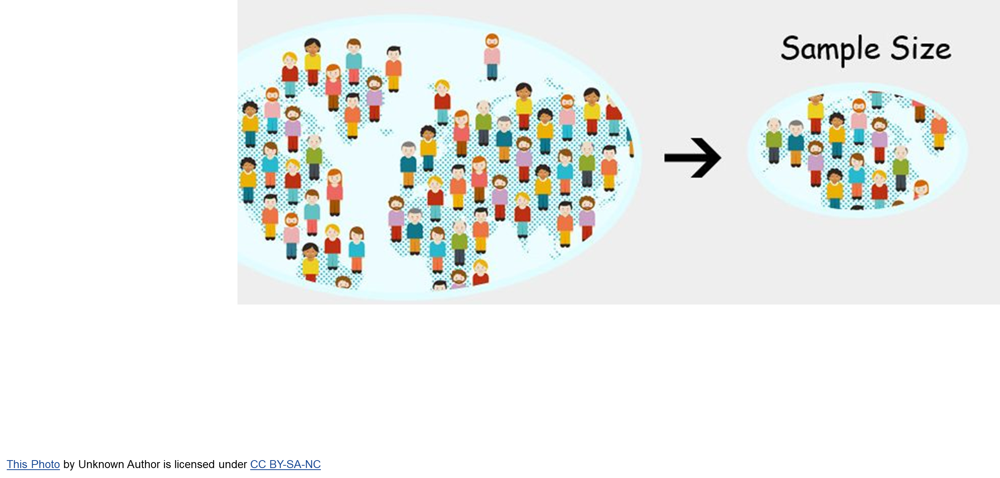

# Population and Sample

## Population
Gathering data from the whole population of interest. A numerical value the summarize a characteristics of entire population is called **PARAMETER**.

Eg:
- Elections in every 5 years
- 10-year census
- All smartphone users in India etc.

## Sample
Gathering data from the sample to make  conclusions about the population. A numerical values that summarizes characteristics of sample is called **STATISTIC**.

Eg:
- Opinion Polls,
- Quality control checks in manufacturing units, etc.

