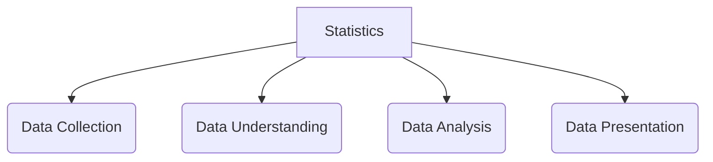

# What is Statistics ?
Statistics is the discipline that concerns the collection, organization, analysis, interpretation, and presentation of data. 
In applying statistics to a scientific, industrial, or social problem, it is conventional to begin with a statistical population or a statistical model to be studied.
**Statistics** provides a way of organizing data to  extract information on a wider and objective.

*Fig 1.1: Branches of Studies of Statistics*

## Why Statistics ?
Statistics is fundamentally about making sense of uncertainty and variability in the world around us. Here's why it's so important:
- Make informed decisions based on evidence rather than guesswork
- Understand trends and patterns in large amounts of information
- Predict future outcomes based on past data
- Communicate findings clearly to others

In simple, statistics is like having a smart tool that helps you understand messy, confusing information and turn it into useful knowledge you can actually use.