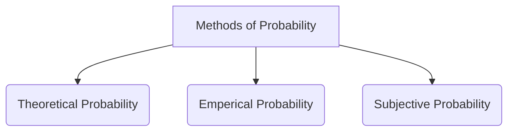

# Methods of Probability 
Here are the three main ways we assign probability, explained simply:

*Fig 1.1: Methods of assigning Probability*

## Theoretical Probability - (Classical)

**What it is:**
When all outcomes are equally likely, you count the favorable outcomes and divide by total possible outcomes.

**Examples:**
- **Coin flip:** 1 way to get heads ÷ 2 total outcomes = 1/2 = 50%
- **Rolling a dice:** 1 way to get a "3" ÷ 6 total numbers = 1/6 = 16.7%
- **Drawing a red card:** 26 red cards ÷ 52 total cards = 26/52 = 50%
- **Lottery ticket:** 1 winning combination ÷ millions of possible combinations = very tiny probability

**When to use:** When you know all possible outcomes and they're all equally likely to happen.

## Empirical Probability - (Relative Frequency)

**What it is:** Look at what happened in the past and use that to estimate future probability.

**Examples:**
- **Free throws:** Basketball player made 80 out of 100 free throws, so probability = 80/100 = 80%
- **Weather:** It rained 12 days out of 30 days last month, so probability of rain = 12/30 = 40%
- **Product defects:** 5 broken items out of 1000 manufactured = 5/1000 = 0.5%
- **Test scores:** Student got A's on 7 out of 10 tests, so probability of getting A = 70%

**When to use:** When you have historical data or can repeat an experiment many times.

## Subjective Probability

**What it is:** Based on personal judgment, experience, or opinion when you can't use math or data.

**How it works:** You make an educated guess based on what you know and feel.

**Examples:**
- **Sports betting:** "I think my team has a 70% chance of winning" (based on team performance, injuries, etc.)
- **Business decisions:** "There's a 60% chance this new product will succeed" (based on market research and experience)
- **Medical diagnosis:** Doctor says "80% chance this treatment will work" (based on experience with similar patients)
- **Job interview:** "I think I have a 30% chance of getting this job" (based on how the interview went)

**When to use:** When you don't have exact data or can't calculate mathematically, but you still need to make decisions.

Each method is useful in different situations, and sometimes people combine them to make better estimates.